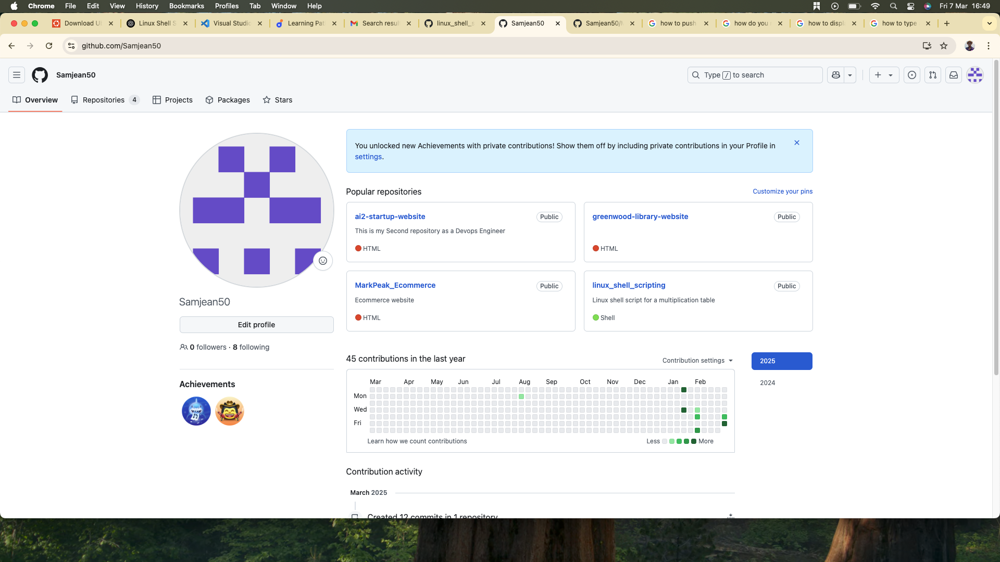
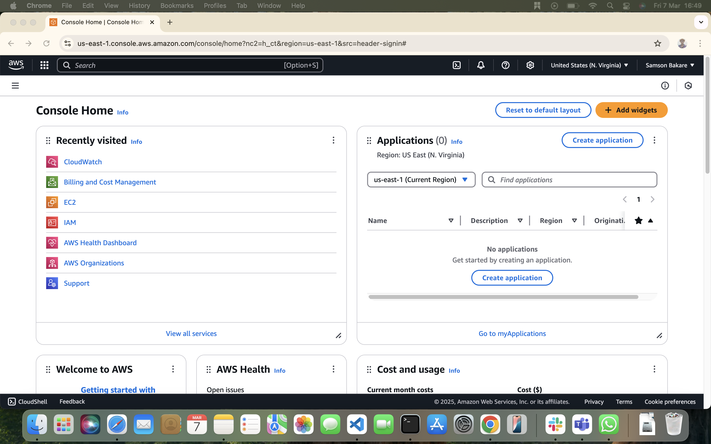

# Tech Environment Setup 

### Project Overview
This project focuses on setting up a development environment by installing essential tools and creating necessary accounts. This document provides detailed installation steps, troubleshooting tips, and configuration guidelines for each tool and account setup.

### 1. Installing Visual Studio Code (VSCode)

#### Steps to Install VSCode 

1. Download VSCode:

Navigate to [VSCode Official Website](https://code.visualstudio.com/) and click Download for your computer type.


(https://github.com/Samjean50/tech_env_setup/edit/main/README.md#:~:text=Vs%20code.-,png,-aws.png))

2. Install VSCode:

Locate the downloaded .zip file in the Downloads folder.

Double-click to extract the Visual Studio Code.app file.

Drag and drop Visual Studio Code.app into the Applications folder.

3. Launch VSCode:

Open Launchpad or Finder > Applications and double-click Visual Studio Code.

4. Verify Installation:

Open VSCode and check the version by navigating to Help > About.


#### Troubleshooting

VSCode won’t open? Try opening from Terminal:

open /Applications/Visual\ Studio\ Code.app

Extensions not working? Ensure your internet connection is stable and restart VSCode.

### 2. Installing Git

#### Steps to Install Git on macOS

1. Download Git:

Visit [Git Website](https://git-scm.com/downloads/win).

Download and install the .dmg file.

Verify Installation:

```git --version```

This should return the installed Git version.


2. Configure Git:

```git config --global user.name "Your Name"```
```git config --global user.email "your.email@example.com"```

#### Troubleshooting

Git command not found? Restart your terminal or try reinstalling Git.

Permission issues? Use:

```sudo xcode-select --install```

#### 3. Installing VirtualBox (Intel Chip macOS)

Steps to Install VirtualBox

1. Download VirtualBox:

Visit [VirtualBox Official Website](https://www.virtualbox.org/).

Download the macOS (Intel) version.


2. Install VirtualBox:

Open the downloaded .dmg file and run the VirtualBox.pkg installer.

Follow the on-screen instructions.

Grant Security Permissions:

Go to System Preferences > Security & Privacy.

Click Allow under System Software from Oracle America, Inc..

3. Verify Installation:

```VBoxManage --version```


#### Troubleshooting

Installation blocked? Ensure macOS security settings allow installation of apps from verified developers.

VirtualBox crashes? Reinstall and restart your Mac.

#### 4. Installing Ubuntu on VirtualBox (Intel Chip macOS)

Steps to Install Ubuntu

1. Download Ubuntu ISO:
Visit [Ubuntu Official Website](https://ubuntu.com/download/desktop) and download the latest Ubuntu version.


1. Create a Virtual Machine in VirtualBox:

Open VirtualBox and click New.

Enter a name (e.g., "Ubuntu"), select Linux, and choose Ubuntu (64-bit).

Allocate at least 4GB RAM and 20GB storage.

3. Attach Ubuntu ISO:

Go to Settings > Storage.

Click Empty under Controller: IDE, then click the CD icon to choose a disk file.

Select the downloaded Ubuntu ISO.

Start the Virtual Machine:

Click Start and follow the on-screen Ubuntu installation instructions.

4. Complete Installation:

Set up a username and password.

Install updates and reboot the virtual machine.

#### Troubleshooting

Virtual Machine won’t start? Ensure virtualization is enabled in BIOS.

Slow performance? Allocate more RAM and processor cores in VirtualBox settings.

#### 5. Creating a GitHub Account

Steps to Create a GitHub Account

- Go to GitHub.

- Click Sign Up.

- Enter your details:

- Choose a username.

- Provide an email address.

- Create a strong password.

- Verify your email.

- Complete account setup and personalize settings.

- Configuring GitHub with Git

- Generate SSH key (if using SSH for authentication):

- ssh-keygen -t rsa -b 4096 -C "your.email@example.com"

- Add the key to GitHub:

- Copy the key: cat ~/.ssh/id_rsa.pub

- Go to GitHub > Settings > SSH and GPG keys.

- Click New SSH Key, paste the key, and save.


#### Troubleshooting

SSH authentication fails? Use:

```ssh -T git@github.com```

#### 6. Creating an AWS Account

- Steps to Create an AWS Account

- Visit AWS Official Site.

- Click ‘Create an AWS Account’.

- Enter required details:

- Provide email, password, and account name.

- Choose Account Type:

- Select Personal or Business.

- Enter Contact Information.

- Provide Payment Information.

- AWS requires a valid credit/debit card for verification.

- Verify Identity:

- Enter the verification code sent to your phone/email.

- Choose a Support Plan.

- Select Basic (Free) unless you need additional support.

- Sign in to AWS Console.



#### Troubleshooting

Payment verification failed? Ensure your card supports international transactions.

Account activation delayed? AWS accounts can take up to 24 hours for full activation.

### Conclusion

By following these steps, you should now have a fully functional tech development environment, including essential tools like VSCode, Git, VirtualBox, and Ubuntu, as well as access to GitHub and AWS for version control and cloud computing. This setup will support software development, cloud computing, and virtualization effectively.

